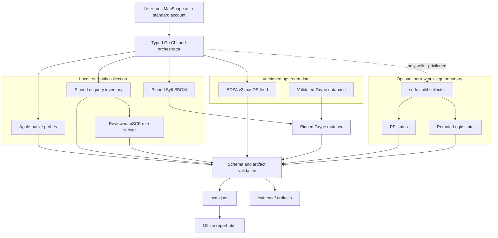
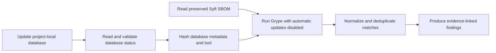

# MacScope — macOS Security Posture & Vulnerability Scanner

### Evidence-preserving security assessment for Apple Silicon Macs


[](LICENSE)

> **Scope:** MacScope is a read-only macOS security posture and vulnerability scanner. It correlates native macOS state, Apple security-release data, compliance checks, installed-software inventory, and package vulnerability matches. It does not exploit vulnerabilities, remove malware, change firewall settings, apply remediation, or prove that a machine is compromised. It writes only project-local tool state and the output directory selected by the user.

---

## Table of Contents

- [Overview](#overview)
- [Executive Summary](#executive-summary)
- [Architecture](#architecture)
- [What MacScope Collects](#what-macscope-collects)
- [Direct Observation vs. Inference](#direct-observation-vs-inference)
- [Requirements](#requirements)
- [Quick Start](#quick-start)
- [Install the Pinned Toolchain](#install-the-pinned-toolchain)
- [Command Reference](#command-reference)
- [Filesystem Scope and Exclusions](#filesystem-scope-and-exclusions)
- [Privilege Boundary](#privilege-boundary)
- [Native macOS Coverage](#native-macos-coverage)
- [SOFA Apple Security Coverage](#sofa-apple-security-coverage)
- [osquery Inventory Coverage](#osquery-inventory-coverage)
- [mSCP Compliance Coverage](#mscp-compliance-coverage)
- [Syft SBOM Coverage](#syft-sbom-coverage)
- [Grype Vulnerability Coverage](#grype-vulnerability-coverage)
- [Evidence and Output Layout](#evidence-and-output-layout)
- [Scan Document Contract](#scan-document-contract)
- [Offline HTML Report](#offline-html-report)
- [Finding and Coverage Taxonomy](#finding-and-coverage-taxonomy)
- [Network Use, Retries, and Timeouts](#network-use-retries-and-timeouts)
- [Interactive CLI Banner](#interactive-cli-banner)
- [Errors and Failure Behavior](#errors-and-failure-behavior)
- [Privacy and Evidence Handling](#privacy-and-evidence-handling)
- [Development and Testing](#development-and-testing)
- [Repository Layout](#repository-layout)
- [Current Limitations](#current-limitations)
- [Upstream Projects and Data Sources](#upstream-projects-and-data-sources)
- [Responsible Use](#responsible-use)
- [Project Status and License](#project-status-and-license)

---

## Overview

MacScope brings several established macOS and software-security data sources into one typed Go command-line application:

- native Apple command-line security probes;
- the [SOFA](https://github.com/macadmins/sofa) v2 macOS security feed;
- [osquery](https://github.com/osquery/osquery) system inventory;
- a reviewed subset of the [macOS Security Compliance Project](https://github.com/usnistgov/macos_security);
- [Syft](https://github.com/anchore/syft) software bill of materials generation; and
- [Grype](https://github.com/anchore/grype) vulnerability matching.

The result is not a simple pass/fail checklist. Every scan records what was attempted, what completed, what was excluded, which executable and data versions were used, which evidence supports each finding, and where coverage remains partial.

MacScope produces two primary outputs:

1. `scan.json` — the strict, machine-readable scan document.
2. `report.html` — an optional self-contained report generated offline from a validated `scan.json`.

---

## Executive Summary

MacScope currently provides:

- native posture checks for SIP, FileVault, Gatekeeper, Application Firewall, firewall stealth mode, Block All, automatic update checking, PF status, Remote Login, and XProtect versions;
- version-and-build-aware macOS CVE assessment using SOFA;
- XProtect baseline comparison using SOFA data;
- application, startup-item, launchd, and listening-socket inventory using osquery;
- four reviewed CIS Level 1 checks translated from mSCP Tahoe Revision 3;
- system and materialized user-home package discovery using Syft;
- vulnerability matching using a validated, project-local Grype database;
- repeatable user-selected file and directory exclusions;
- automatic exclusion of OneDrive content and dataless iCloud placeholders;
- optional, narrowly scoped `sudo` collection without running the scanner as root;
- SHA-256-linked evidence artifacts and pinned upstream provenance;
- deterministic, JavaScript-free offline HTML reporting;
- structured JSON warnings and errors; and
- a randomized, animated ANSI/FIGlet-style terminal banner with version and build identity.

### Security interpretation

MacScope distinguishes posture observations from compromise evidence:

| Observation | What MacScope concludes | What MacScope does not conclude |
|---|---|---|
| A security control is disabled | The current configuration weakens the named control. | The Mac is compromised. |
| A package version matches a vulnerability record | The recorded package identity and version require applicability review. | Vulnerable code ran or was exploited. |
| Remote Login is enabled | SSH service access is configured. | The service is reachable from the LAN or internet. |
| PF is disabled | PF is not currently reported active by `pfctl`. | Application Firewall is disabled. |
| Application Firewall Block All is disabled | Block All is not enabled. | The firewall is disabled or the host is externally reachable. |
| A scan area is partial | Named content or checks were not fully assessed. | Unscanned areas are safe. |

---

## Architecture



The privileged process returns structured evidence to the standard-user parent. The parent validates and writes the complete result, so third-party tools and report generation do not run as root.

---

## What MacScope Collects

| Collector | Coverage | Privilege | Network | Preserved evidence |
|---|---|---:|---:|---|
| Native macOS commands | Host identity, controls, XProtect | Standard user | No | Exact command, exit status, stdout, stderr, timestamps |
| Narrow privileged collector | PF status and Remote Login | Optional `sudo` child | No | Same command evidence returned to parent |
| SOFA v2 | macOS releases, CVEs, KEV state, XProtect baselines | Standard user | HTTPS | Exact feed response and SHA-256 |
| osquery | Apps, startup items, launchd definitions, listening sockets | Standard user | No | Query, output, errors, timing, row counts |
| mSCP adapter | Four reviewed CIS Level 1 checks | Standard user | No | Pinned translation manifest and rule provenance |
| Syft | Startup-volume and materialized home-directory package inventory | Standard user | No remote enrichment | SBOM, runtime scope, command metadata |
| Grype | Package vulnerability matches | Standard user | Database update only | Database identity, raw matches, command metadata |

MacScope intentionally avoids collecting the hardware serial number and platform identifiers. The hardware probe uses the minimal `system_profiler` detail level and only retains the model identifier and chip description required by the scan schema.

---

## Direct Observation vs. Inference

MacScope keeps observed state, data-source matching, and interpretation separate.

### Direct observations

- output from fixed native macOS commands;
- rows returned by fixed osquery SQL;
- versions and hashes reported by pinned executables;
- package identities and file locations reported by Syft;
- records returned by the exact SOFA feed;
- Grype database metadata and normalized matches; and
- filesystem metadata used to identify dataless iCloud items.

### Derived assessments

- a disabled security control is translated into a configuration finding;
- a newer exact macOS release/build in SOFA is translated into a version-based CVE exposure inference;
- a lower local XProtect version is translated into an update-posture finding;
- a reviewed mSCP query result is compared with its expected value; and
- a Grype package/version match is translated into a software-vulnerability finding.

### Not established by a scan

- exploitability on the specific hardware and runtime configuration;
- proof of exploitation or malware execution;
- LAN, NAT, VPN, or internet reachability;
- absence of vulnerabilities outside collected coverage;
- full CIS compliance;
- safety of excluded, unreadable, or cloud-only files; or
- correctness of every upstream advisory or package identity.

---

## Requirements

The current dependency lock targets:

- macOS on Apple Silicon (`darwin/arm64`);
- Go `1.26.5` for development and builds;
- osquery `5.21.0`;
- Syft `1.50.0`;
- Grype `0.116.1`; and
- mSCP Tahoe Revision 3 for macOS 26 compliance translation.

Additional requirements:

- Terminal access;
- HTTPS access to download the pinned tools;
- HTTPS access to the SOFA feed and Grype database service during a scan;
- enough free space for the project-local Grype database, SBOM, raw vulnerability report, and evidence; and
- administrator authorization only when `--privileged` is explicitly requested.

The mSCP checks are supported only on macOS 26. Other macOS versions receive an explicit unsupported/partial compliance result rather than a false compliance claim.

---

## Quick Start

From the repository root, after installing the pinned tools:

```sh
./.tools/go/bin/go test ./...
./.tools/go/bin/go build -trimpath -o ./bin/macscope ./cmd/macscope
./bin/macscope scan --output ./scan-results/first-scan
./bin/macscope report \
  --input ./scan-results/first-scan/scan.json \
  --output ./scan-results/first-scan/report.html
```

Open `report.html` locally in a browser. Treat both the JSON and HTML as potentially sensitive system inventory.

---

## Install the Pinned Toolchain

MacScope does not use Homebrew executables or arbitrary programs from `PATH`. It resolves project-local tools under `.tools/` and verifies them against [`tools.lock.json`](tools.lock.json).

The commands below are intended for a fresh checkout. Review every calculated digest against `tools.lock.json` before extracting or executing a download.

### 1. Go

```sh
mkdir -p .tools/downloads
curl --fail --location \
  https://go.dev/dl/go1.26.5.darwin-arm64.tar.gz \
  --output .tools/downloads/go1.26.5.darwin-arm64.tar.gz
shasum -a 256 .tools/downloads/go1.26.5.darwin-arm64.tar.gz
tar -xzf .tools/downloads/go1.26.5.darwin-arm64.tar.gz -C .tools
./.tools/go/bin/go version
```

### 2. osquery

```sh
mkdir -p .tools/osquery/5.21.0 .tools/downloads
curl --fail --location \
  https://github.com/osquery/osquery/releases/download/5.21.0/osquery-5.21.0_1.macos_arm64.tar.gz \
  --output .tools/downloads/osquery-5.21.0_1.macos_arm64.tar.gz
shasum -a 256 .tools/downloads/osquery-5.21.0_1.macos_arm64.tar.gz
tar -xzf .tools/downloads/osquery-5.21.0_1.macos_arm64.tar.gz \
  -C .tools/osquery/5.21.0 \
  --strip-components=3 \
  usr/local/bin/osqueryi
shasum -a 256 .tools/osquery/5.21.0/osqueryi
```

### 3. Syft and Grype

```sh
mkdir -p \
  .tools/syft/1.50.0 \
  .tools/grype/0.116.1 \
  .tools/grype/db \
  .tools/downloads

curl --fail --location \
  https://github.com/anchore/syft/releases/download/v1.50.0/syft_1.50.0_darwin_arm64.tar.gz \
  --output .tools/downloads/syft_1.50.0_darwin_arm64.tar.gz
curl --fail --location \
  https://github.com/anchore/grype/releases/download/v0.116.1/grype_0.116.1_darwin_arm64.tar.gz \
  --output .tools/downloads/grype_0.116.1_darwin_arm64.tar.gz

shasum -a 256 \
  .tools/downloads/syft_1.50.0_darwin_arm64.tar.gz \
  .tools/downloads/grype_0.116.1_darwin_arm64.tar.gz

tar -xzf .tools/downloads/syft_1.50.0_darwin_arm64.tar.gz \
  -C .tools/syft/1.50.0 syft
tar -xzf .tools/downloads/grype_0.116.1_darwin_arm64.tar.gz \
  -C .tools/grype/0.116.1 grype

shasum -a 256 \
  .tools/syft/1.50.0/syft \
  .tools/grype/0.116.1/grype
```

MacScope verifies each third-party executable before collection and rehashes osquery, Syft, and Grype after their work to detect substitution during a scan. Version, commit, platform, archive, executable, mSCP baseline, and source digests are maintained in `tools.lock.json` and the typed collectors.

---

## Command Reference

```text
Usage:
  macscope scan --output <directory> [--privileged] [--exclude <absolute-path>]...
  macscope report --input <scan.json> --output <report.html>
  macscope version
  macscope help
```

### Basic scan

```sh
./bin/macscope scan --output ./scan-results/scan-001
```

The output directory may be new or existing, but MacScope refuses to overwrite `scan.json` or any evidence artifact already present there. Use a unique directory for each run.

### Privileged scan

```sh
./bin/macscope scan \
  --output ./scan-results/scan-privileged \
  --privileged
```

The password prompt belongs to `/usr/bin/sudo`. MacScope never accepts, reads, logs, transmits, or stores the password.

### Exclude directories or individual files

```sh
./bin/macscope scan \
  --output ./scan-results/custom-scope \
  --exclude "/Users/example/Documents/Private Project" \
  --exclude "/Users/example/Downloads/large-archive.tar"
```

Add `--exclude` once for every selected path. Paths must be absolute and exist when the scan starts. MacScope cleans, sorts, and deduplicates the list. It refuses relative paths, missing paths, and the filesystem root `/`.

### Generate an offline report

```sh
./bin/macscope report \
  --input ./scan-results/custom-scope/scan.json \
  --output ./scan-results/custom-scope/report.html
```

### Show version or help

```sh
./bin/macscope version
./bin/macscope help
```

---

## Filesystem Scope and Exclusions

Syft scans `dir:/` on the startup volume as the signed-in user. The goal is broad package discovery without downloading cloud placeholders or spending test time in known large, volatile, duplicate, or private locations.

### Included by design

- readable system software locations;
- installed applications visible on the startup volume;
- user home directories; and
- iCloud files that are already materialized locally.

### Fixed safety exclusions

- `/dev`;
- `/Volumes` and duplicate macOS data volumes;
- `/System/Volumes`;
- temporary, cache, migration, model-asset, and volatile data trees;
- `/private/var`;
- all recognized OneDrive roots, provider containers, and legacy home links;
- MacScope's `.tools/`, `bin/`, and `scan-results/` directories;
- the protected `authserver` tree and its `weakpass_edit` symlink; and
- iCloud items carrying the macOS `SF_DATALESS` filesystem flag.

MacScope walks iCloud filesystem metadata without opening file contents. A dataless directory is excluded with its subtree, while a dataless file is excluded exactly. This allows already-local iCloud data to remain in scope without requesting downloads of cloud-only files.

### User-selected exclusions

- Directory choice: excludes the directory entry and complete subtree.
- File choice: excludes that exact file.
- Glob metacharacters in literal paths are escaped.
- Choices are combined with fixed exclusions.
- The resulting runtime scope is preserved as `evidence/syft/scan-scope.yaml`.

These exclusions apply only to Syft filesystem-content and package scanning. Native probes and osquery inventory still run because they do not recursively read the selected file contents. Syft coverage is always marked `partial`, with a reason that records the number and type of omissions.

Excluded content is never deleted, moved, opened for content scanning, or modified by the exclusion preparation process.

---

## Privilege Boundary

The complete scanner must run as the signed-in user:

```sh
./bin/macscope scan --output ./scan-results/example --privileged
```

Do not run:

```sh
sudo ./bin/macscope scan --output ./scan-results/example
```

MacScope rejects a root orchestrator. When `--privileged` is selected, the parent invokes the same executable through `/usr/bin/sudo` with a private internal collector command. That child:

- requires effective UID `0`;
- executes only the fixed PF and Remote Login probes;
- returns strictly decoded structured JSON to the parent; and
- does not run SOFA, osquery, Syft, Grype, schema writing, or HTML generation.

If authorization is canceled or fails, the requested privileged scan stops with an explicit error. MacScope does not silently continue with reduced privileged coverage.

Without `--privileged`, PF and Remote Login receive `not_scanned` coverage records and informational coverage-gap findings. That makes the overall run status `partial`.

---

## Native macOS Coverage

MacScope executes fixed absolute-path commands. It does not execute user-supplied commands or arbitrary upstream remediation scripts.

| Probe | Command source | Finding behavior |
|---|---|---|
| macOS version/build | `/usr/bin/sw_vers` | Host identity only |
| Hardware model/chip | `/usr/sbin/system_profiler` minimal JSON | Host identity only; no serial retained |
| System Integrity Protection | `/usr/bin/csrutil status` | High if disabled |
| FileVault | `/usr/bin/fdesetup status` | High if disabled |
| Gatekeeper | `/usr/sbin/spctl --status` | High if disabled |
| Application Firewall | `socketfilterfw --getglobalstate` | Medium if disabled |
| Firewall stealth mode | `socketfilterfw --getstealthmode` | Observation; mSCP evaluates compliance separately |
| Firewall Block All | `socketfilterfw --getblockall` | Observation only |
| Automatic update checking | `/usr/sbin/softwareupdate --schedule` | Medium if disabled |
| XProtect configuration | Apple bundle plist | Compared with SOFA baseline |
| XProtect framework | Apple app bundle plist | Compared with SOFA baseline |
| XProtect plugin service | Apple XPC bundle plist | Compared with SOFA baseline |
| PF runtime status | `/sbin/pfctl -s info` | Privileged observation only |
| Remote Login | `/usr/sbin/systemsetup -getremotelogin` | Low if enabled |

Application Firewall and PF are independent controls. An Application Firewall result does not establish PF state, and a PF result does not establish Application Firewall state. Block All being off is not equivalent to the firewall being off.

Each probe records the exact argument vector, timestamps, exit code, execution error, and exact stdout/stderr bytes encoded in the artifact. A command or parse failure creates failed coverage and a `tool_error` finding rather than silently dropping the probe.

---

## SOFA Apple Security Coverage

MacScope requests:

```text
https://sofafeed.macadmins.io/v2/macos_data_feed.json
```

The adapter requires the SOFA v2 structure and validates required release, CVE, actively exploited, KEV, XProtect, timestamp, URL, array, and digest fields. Unrelated additive fields are ignored so compatible feed extensions do not break the scanner.

### macOS assessment logic

1. Match the installed macOS major release.
2. Require the exact installed product version.
3. Require the installed build to appear in the release's published build set.
4. Compare with newer security releases for the same major version.
5. Preserve CVE identifiers, upstream severity, actively exploited state, KEV state, references, and release metadata.

If the exact version/build cannot be established, MacScope reports a coverage limitation instead of inferring exposure from a nearby release.

### XProtect assessment logic

MacScope compares local versions for:

- XProtect configuration data;
- XProtect framework; and
- XProtect plugin service.

A lower installed version produces an update-posture finding. It is not evidence that malware is present.

The exact response body is stored in `evidence/sofa/` with its SHA-256 and source metadata.

---

## osquery Inventory Coverage

MacScope pins osquery `5.21.0` by archive, executable digest, commit, runtime version, and platform. It runs the project-local `osqueryi` with persistent storage, events, and extensions disabled.

Fixed queries collect:

- application bundle name, path, identifier, short version, and bundle version;
- Background Task Management startup-item metadata;
- launchd definition path, label, program, load/keepalive state, user, and group; and
- listening socket address, port, protocol, family, PID, process name, and process path.

Results are decoded into query-specific typed rows. Required identities, absolute paths, unique application paths, and numeric socket fields are validated. A wildcard or loopback listener is reported as local socket evidence; it is not automatically described as remotely reachable.

Each query has a 30-second timeout and preserves its SQL command, raw JSON, stderr, timestamps, exit status, and parse result under `evidence/osquery/`.

---

## mSCP Compliance Coverage

The compliance adapter pins [mSCP Tahoe Revision 3](https://github.com/usnistgov/macos_security/releases/tag/tahoe_rev3) by tag, commit, release timestamp, source archive, baseline digest, and individual rule-file digests.

The upstream CIS Level 1 baseline contains 100 rules. MacScope currently implements four reviewed rules as fixed osquery SQL:

| mSCP rule | MacScope severity |
|---|---:|
| Ensure System Integrity Protection is Enabled | High |
| Enable Gatekeeper | High |
| Enable macOS Application Firewall | Medium |
| Enable Firewall Stealth Mode | Medium |

The translation manifest is preserved as:

```text
evidence/mscp/tahoe_rev3_cis_lvl1_osquery_subset.json
```

MacScope always marks mSCP coverage `partial` because four rules are not the complete baseline. It does not execute upstream remediation, generated `sudo` compliance scripts, mobile configuration deployment, or arbitrary shell embedded in rule YAML.

---

## Syft SBOM Coverage

MacScope pins Syft `1.50.0` and verifies:

- executable SHA-256;
- reported application name;
- reported version;
- Git commit; and
- `darwin/arm64` platform identity.

Syft scans the startup volume using a runtime configuration built from the fixed [`config/syft.yaml`](config/syft.yaml) plus fixed, dataless-iCloud, and user-selected exclusions.

The fixed configuration disables:

- Syft application-update checks;
- remote package enrichment;
- remote license searches;
- Maven local repository use; and
- unnecessary license-content collection.

The complete Syft JSON SBOM is preserved even when it is large. Scan command metadata includes the source name, macOS version, runtime scope path, timestamps, exit status, stderr, output byte count, and SHA-256.

---

## Grype Vulnerability Coverage

MacScope pins Grype `0.116.1` using the same executable identity checks as Syft.

The matching sequence is:



The [`config/grype.yaml`](config/grype.yaml) file disables Grype application-update checks, external sources, and automatic database updates during matching. MacScope performs the separate database update explicitly, validates status and age, then matches against that known project-local state.

MacScope deterministically merges duplicate normalized vulnerability/package pairs returned from multiple database namespaces only when package identity is the same. It retains references, fixed versions, CVSS, EPSS, known-exploited state, and match methods.

- Exact ecosystem matches receive high confidence.
- CPE-derived matches receive medium confidence and require manual identity/applicability review.

A Grype finding is a package-version match, not proof that the vulnerable code path exists, ran, or was exploited.

---

## Evidence and Output Layout

A complete run resembles:

```text
scan-results/example/
├── scan.json
├── report.html                         # only after the report command
└── evidence/
    ├── grype/
    │   ├── db-status.json
    │   ├── db-update-attempt-*.json
    │   ├── grype-version.json
    │   ├── vulnerability-match.execution.json
    │   └── vulnerability-report.json
    ├── mscp/
    │   └── tahoe_rev3_cis_lvl1_osquery_subset.json
    ├── native/
    │   ├── application-firewall.json
    │   ├── automatic-update-check.json
    │   ├── filevault.json
    │   ├── firewall-block-all.json
    │   ├── firewall-stealth.json
    │   ├── gatekeeper.json
    │   ├── hardware-model.json
    │   ├── macos-version.json
    │   ├── sip.json
    │   ├── xprotect-config-version.json
    │   ├── xprotect-framework-version.json
    │   └── xprotect-plugin-version.json
    ├── osquery/
    │   ├── apps.json
    │   ├── launchd.json
    │   ├── listening-ports.json
    │   ├── mscp-*.json
    │   ├── startup-items.json
    │   └── version.json
    ├── sofa/
    │   └── macos_data_feed_v2.json
    └── syft/
        ├── filesystem-sbom.execution.json
        ├── filesystem.sbom.syft.json
        ├── scan-scope.yaml
        └── syft-version.json
```

Privileged runs additionally preserve `evidence/native/pf-status.json` and `evidence/native/remote-login.json`.

Every referenced artifact uses a path relative to the scan output directory, a media type, and a lowercase SHA-256. Before writing, MacScope verifies that:

- every artifact is referenced by exactly one evidence record;
- every referenced artifact has supplied content;
- there are no duplicate artifact paths;
- calculated and recorded digests match; and
- paths cannot escape the selected output directory.

Files are created without overwrite permission. Evidence is synced and closed before the scan document is finalized.

---

## Scan Document Contract

`scan.json` uses schema version `1` and contains:

- scanner identity and version;
- UUID-style run ID;
- hostname, OS, architecture, macOS version/build, model, and chip;
- UTC start and completion timestamps;
- overall run status;
- privilege request and effective-UID evidence;
- executable, feed, matcher, and database provenance;
- per-area coverage records;
- evidence records and artifact references; and
- findings, vulnerabilities, affected components, remediation, and references.

Validation rejects:

- unknown JSON fields or trailing JSON values;
- null top-level arrays;
- unknown tool or evidence references;
- duplicate IDs or artifact paths;
- invalid enum values;
- unsafe absolute or traversal artifact paths;
- malformed SHA-256, CVE, GHSA, or OSV identities;
- non-HTTPS upstream references;
- out-of-range CVSS or EPSS values;
- inconsistent known-exploited state;
- inconsistent privilege evidence; and
- collector or finding timestamps outside the scan interval.

Top-level `tools`, `coverage`, `evidence`, and `findings` fields are always JSON arrays, including when empty.

An overall run is `completed` only when every coverage record is `complete`. Any `partial`, `not_scanned`, or `failed` coverage record makes the overall status `partial`. Individual tool failures remain visible in coverage and findings.

---

## Offline HTML Report

The report command:

- reads at most 512 MiB from a regular `scan.json` file;
- strictly decodes and revalidates the document;
- calculates and displays the source JSON SHA-256;
- refuses to overwrite an existing output file;
- embeds all styling locally;
- includes no JavaScript, analytics, remote fonts, or remote assets; and
- HTML-escapes host fields, package paths, descriptions, and remediation text.

Coverage failures and limitations appear before finding details. Findings are sorted deterministically by:

1. severity;
2. known-exploited status;
3. confidence;
4. maximum CVSS;
5. maximum EPSS;
6. title; and
7. stable finding ID.

---

## Finding and Coverage Taxonomy

### Finding categories

| Category | Intended meaning |
|---|---|
| `os_vulnerability` | macOS release/build vulnerability inference |
| `software_vulnerability` | Installed package/version vulnerability match |
| `configuration` | Security-control or compliance state |
| `network_exposure` | Local service or network-related state |
| `persistence` | Persistence-related observation or assessment |
| `threat_indicator` | Threat-oriented observation when implemented |
| `coverage_gap` | Explicitly unassessed or partial scope |
| `tool_error` | Collector, parser, verification, or data failure |

Severities are `info`, `low`, `medium`, `high`, and `critical`. Confidence levels are `low`, `medium`, `high`, and `confirmed`.

### Coverage areas

- `host_identity`
- `apple_updates`
- `security_controls`
- `persistence`
- `network_exposure`
- `installed_software`
- `dependency_vulnerabilities`
- `threat_indicators`

Coverage states are `complete`, `partial`, `not_scanned`, and `failed`. Every non-complete record must include an explicit reason.

---

## Network Use, Retries, and Timeouts

| Operation | Limit | Retry behavior |
|---|---:|---|
| SOFA HTTPS request | 20 seconds per request; 8 MiB response limit | Up to 3 attempts with 250 ms and 500 ms delays |
| osquery query | 30 seconds per query | No hidden fallback |
| Syft startup-volume scan | 30 minutes | No hidden fallback |
| Grype database update | 10 minutes per attempt | Up to 3 attempts with 1 s and 2 s delays |
| Grype database status | 10 minutes | No hidden fallback |
| Grype SBOM matching | 10 minutes | No hidden fallback |
| HTML report input | 512 MiB maximum | Offline; no network |

Retry warnings are emitted as structured JSON. After the final attempt, MacScope reports the last error rather than substituting stale or unverified data.

---

## Interactive CLI Banner

When stdout is an interactive terminal, MacScope:

1. randomly selects one of three built-in ASCII/FIGlet-style designs;
2. animates through bright red, yellow, green, cyan, blue, magenta, and red;
3. shows MacScope version, VCS revision, modified-build state, platform, and Go version; and
4. transitions into the selected CLI command.

No `figlet`, `lolcat`, Homebrew package, or network request is required.

Piped and redirected output suppresses the banner automatically. Available controls:

```sh
NO_COLOR=1 ./bin/macscope help
TERM=dumb ./bin/macscope help
MACSCOPE_NO_BANNER=1 ./bin/macscope help
```

`NO_COLOR` and `TERM=dumb` retain a plain banner in an interactive terminal. `MACSCOPE_NO_BANNER=1` disables it completely.

---

## Errors and Failure Behavior

CLI errors are written to stderr as one-line JSON:

```json
{"level":"error","type":"scan","message":"validate user-selected filesystem exclusions: ..."}
```

Usage errors also print the command synopsis and return exit code `2`. Runtime, scan, report, privilege, and banner failures return exit code `1`.

MacScope does not silently:

- downgrade a requested privileged scan;
- use an unpinned executable from `PATH`;
- accept a mismatched executable or database digest;
- overwrite existing evidence;
- ignore malformed upstream data;
- turn invalid rows into valid inventory;
- omit a failed collector from coverage; or
- claim complete coverage when anything is partial, skipped, or failed.

---

## Privacy and Evidence Handling

Scan output can contain sensitive information, including:

- hostname and Mac model;
- installed application and package names, versions, and paths;
- home-directory paths included in package evidence;
- launchd and startup-item definitions;
- local listener addresses, ports, PIDs, and process paths;
- security-control state;
- user-selected exclusion paths; and
- raw upstream vulnerability matches.

Operational guidance:

- keep `scan-results/` private;
- review `scan.json`, `report.html`, and `evidence/` before sharing;
- do not publish home paths or application inventories unintentionally;
- use a new output directory for every scan;
- preserve the complete evidence directory when retaining a report;
- hash archives before transferring them; and
- do not treat unfamiliar packages or listeners as malicious without corroboration.

`.gitignore` excludes `.tools/`, `bin/`, and `scan-results/`. The repository is designed to publish source, fixed configuration, tests, CI, and lock metadata without publishing local databases, downloaded executables, builds, or private host reports.

---

## Development and Testing

Use the pinned project-local Go toolchain:

```sh
./.tools/go/bin/gofmt -w ./cmd ./internal
./.tools/go/bin/go vet ./...
./.tools/go/bin/go test ./...
./.tools/go/bin/go test -race ./...
./.tools/go/bin/go test -shuffle=on -count=3 ./...
./.tools/go/bin/go build -trimpath -o ./bin/macscope ./cmd/macscope
```

The current test suite covers CLI parsing, banner behavior, strict model validation, artifact safety, native parsers, privilege decoding, SOFA retries and schema validation, osquery parsing, mSCP provenance, Syft scope generation, Grype match normalization, scan writing, and offline report generation.

### GitHub Actions

[`ci.yml`](.github/workflows/ci.yml) runs on a macOS 26 hosted runner for pushes and pull requests. It uses:

- read-only repository permissions;
- immutable GitHub Action commit revisions;
- disabled checkout credential persistence;
- formatting and `go vet` checks;
- race-enabled and shuffled tests;
- a reproducible CLI build; and
- non-interactive help/version smoke tests.

CI does not install osquery, Syft, or Grype; update vulnerability databases; request `sudo`; scan the runner; upload artifacts; or publish reports.

---

## Repository Layout

```text
MacScope/
├── .github/workflows/ci.yml       # macOS build and test workflow
├── .gitignore                     # excludes tools, builds, and private reports
├── README.md
├── cmd/macscope/                  # executable entry point
├── config/
│   ├── grype.yaml                 # offline matching policy
│   └── syft.yaml                  # no-enrichment SBOM policy
├── go.mod                         # Go language and toolchain version
├── internal/
│   ├── artifact/                  # in-memory artifact records
│   ├── banner/                    # terminal startup presentation
│   ├── cli/                       # strict command parsing
│   ├── model/                     # schema types, codec, and validation
│   ├── mscp/                      # reviewed compliance translation
│   ├── native/                    # fixed Apple-native probes
│   ├── osquery/                   # pinned inventory collector
│   ├── privilege/                 # narrow sudo boundary
│   ├── report/                    # deterministic offline HTML
│   ├── scan/                      # orchestration and safe output writing
│   ├── sofa/                      # SOFA client and assessment adapter
│   ├── supplychain/               # Syft, Grype, scope, and findings
│   └── version/                   # version/build identity
└── tools.lock.json                # pinned versions, commits, URLs, and digests
```

Generated local directories:

```text
.tools/       # pinned Go and scanner dependencies, runtime scope, Grype DB
bin/          # MacScope executable
scan-results/ # private scan documents, evidence, and HTML reports
```

---

## Current Limitations

- Current pinned third-party binaries target Apple Silicon only.
- mSCP translation covers 4 of 100 CIS Level 1 rules and macOS 26 only.
- Syft coverage is intentionally partial because of fixed and user-selected exclusions.
- Dataless iCloud content is not downloaded or scanned.
- OneDrive content is not scanned.
- Protected or unreadable paths are not bypassed by running Syft as root.
- External volumes and duplicate system/data volumes are excluded.
- Network listeners are local observations; MacScope does not test reachability from another device.
- Package vulnerability matches can contain upstream identity or applicability errors.
- SOFA macOS findings are version/build inferences, not runtime exploit tests.
- There is no malware removal, remediation execution, continuous monitoring, GUI, daemon, MDM deployment, or remote fleet controller.
- The scanner currently updates the Grype database for each complete scan rather than providing a separate offline database-management command.
- A large system/home SBOM and raw vulnerability report may consume substantial time and disk space.

---

## Upstream Projects and Data Sources

MacScope integrates but does not replace or claim ownership of these projects:

| Project | Role in MacScope | Pinned release |
|---|---|---:|
| [SOFA](https://github.com/macadmins/sofa) | macOS security releases, CVEs, KEV, XProtect baselines | Feed schema v2 |
| [osquery](https://github.com/osquery/osquery) | Typed local system inventory | 5.21.0 |
| [mSCP](https://github.com/usnistgov/macos_security) | Compliance rule provenance | Tahoe Revision 3 |
| [Syft](https://github.com/anchore/syft) | Software bill of materials | 1.50.0 |
| [Grype](https://github.com/anchore/grype) | Vulnerability database and matching | 0.116.1 |
| [Go](https://go.dev/) | Build toolchain | 1.26.5 |

Exact commits, archive URLs, archive SHA-256 values, executable SHA-256 values, platforms, and mSCP baseline identity are authoritative in [`tools.lock.json`](tools.lock.json).

Apple, macOS, FileVault, Gatekeeper, XProtect, and related marks are trademarks of Apple Inc. MacScope is an independent research and defensive-security project and is not affiliated with or endorsed by Apple, the upstream projects, or their maintainers.

---

## Responsible Use

Run MacScope only on Macs you own or are explicitly authorized to assess. Review organizational policy before collecting application, persistence, listener, or home-directory package inventory.

Findings should be verified before remediation or escalation. Security controls can be intentionally disabled for documented research, recovery, development, or compatibility workflows. Package matches and unusual processes require supporting evidence before they are described as vulnerable, malicious, or compromised.

---

## Project Status and License

MacScope is currently `0.1.0-dev` and under active development. The command schema is versioned, but CLI flags, collector coverage, evidence formats, and dependency pins may change before a stable release.

MacScope is licensed under the [Apache License 2.0](LICENSE). The license permits commercial use, distribution, modification, patent use, and private use, subject to its license-notice and change-notice conditions. It includes limitations of liability and warranty and does not grant trademark rights.

Copyright 2026 hideouts-io.

Third-party tools and data sources retain their own licenses and terms. MacScope's license does not relicense osquery, mSCP, Syft, Grype, SOFA, Go, Apple software, or downloaded vulnerability data.

No source commit, remote repository creation, or GitHub upload is performed automatically by MacScope.
